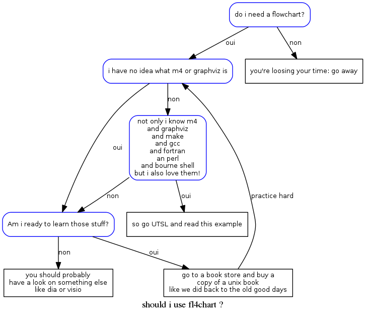

% fl4chart

# Frankly ...

Don't expect the result to have good looking: this is current set of macros are
made to do quick but yet reasonable render of flow charts. So fl4chart is good
for real time note taking as well as having a gitable form of a flowchart. 

As example, click on the flow chart to read the fl4 source

`fl4` (i prononce it like "floor") is a contraction of `m4` and `flow`. It is
a very simple set of m4 macros to write flow charts. 

# what is a flow chart? 

what we need to do to get things done is

* asking questions
* describing different anwsers for this question
* take actions based those answer

# the fl4chart commands

nodes are either a question to ask or a procedure to follow. the following
functions creates a node as well as set the source of the next edges.

    ASK(ident,description)
    PROC(ident,description)

edges are the reason for changing from a node to another, the default source
node was set by `ASK` or `PROC` and the destination are passed as argument. 

    WHEN(description,nextNode) 
    YN(yesNode,noNode)

